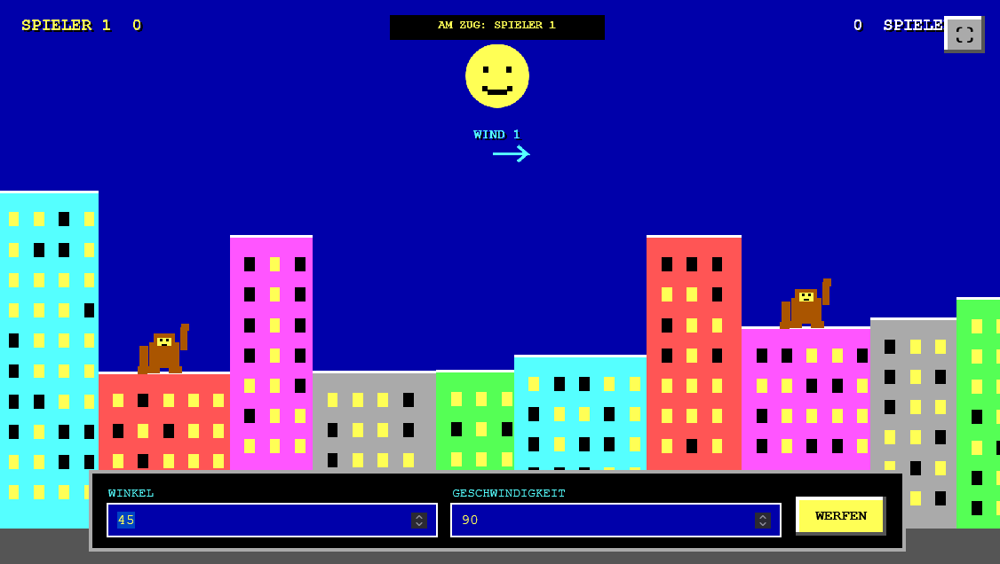

# GORILLAS

Eine browserbasierte Retro-Neuinterpretation des klassischen QBasic-Spiels **Gorillas**.

## Start

`index.html` direkt im Browser öffnen. Es ist kein Build-Schritt, kein Server und keine Installation erforderlich.

## Bedienung

1. Namen für beide Spieler eintragen.
2. Die benötigte Punktzahl und Gravitation auswählen.
3. **SPIEL STARTEN** anklicken.
4. Winkel und Geschwindigkeit festlegen.
5. Mit **WERFEN** die Banane abschießen.
6. Nach jedem Wurf ist der andere Spieler an der Reihe.

Der Button oben rechts aktiviert den Vollbildmodus. Im Vollbildmodus passt sich das Spielfeld an die verfügbare Bildschirmfläche an.

## Spielregeln

- Die Banane fliegt in einer physikalischen Parabel.
- Wind beeinflusst die Flugbahn und wird in der Mitte des Spielfelds angezeigt.
- Gebäude blockieren die Flugbahn.
- Trifft die Banane einen Gorilla, erhält der gegnerische Spieler einen Punkt.
- Nach einem Treffer wird eine neue Skyline für die nächste Runde erzeugt.
- Wer zuerst die eingestellte Punktzahl erreicht, gewinnt das Spiel.
- Mit `N` kann nach einem gewonnenen Spiel eine neue Partie gestartet werden.

## Varianten

Die Gravitation kann zwischen drei Varianten gewechselt werden:

- **Mond**: langsame, hohe Flugbahn
- **Erde**: normale Spielphysik
- **Jupiter**: schnelle, stark gekrümmte Flugbahn

## Technik

- Reines HTML, CSS und JavaScript
- HTML5-Canvas mit interner Auflösung von 1920 × 1080 Pixeln
- Pixelige Retro-Darstellung ohne externe Abhängigkeiten
- Zufällig erzeugte Gebäude, Fenster und Windwerte
- Web Audio API für kurze PC-Speaker-artige Soundeffekte
- Responsive Darstellung für Desktop und Mobilgeräte

## Dateien

| Datei | Zweck |
| --- | --- |
| `index.html` | Vollständiges Spiel inklusive Oberfläche, Grafik, Physik und Sound |
| `README.md` | Projektbeschreibung und Bedienungsanleitung |
